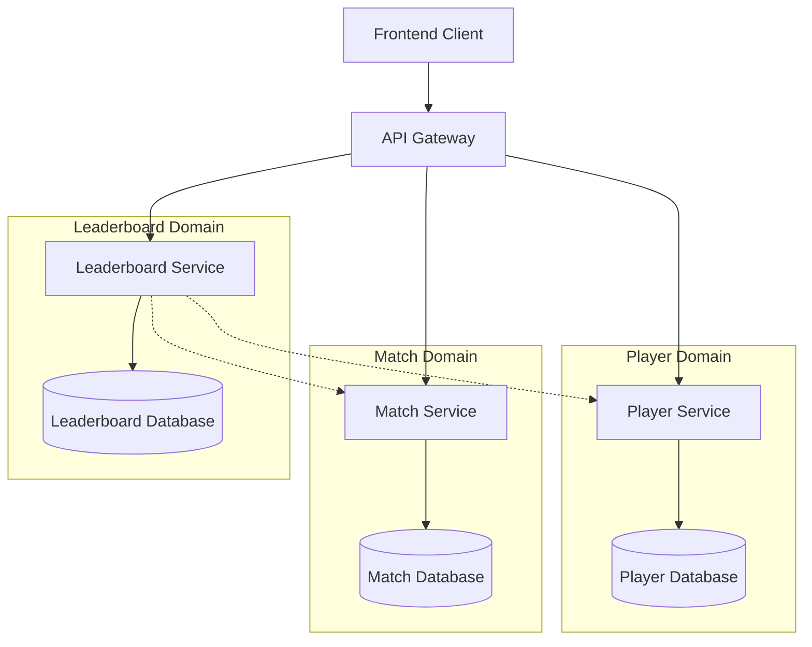
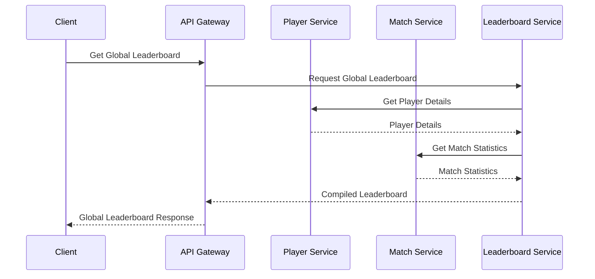
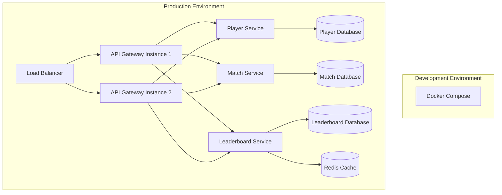

# Love Rank Pulse - Microservices Architecture Plan

## System Overview

Love Rank Pulse is a real-time leaderboard system for a multiplayer shooter game that displays player rankings across three scopes: current match (session), country, and global. The system is designed to provide players with immediate feedback on their performance relative to other players, maintaining engagement and motivation.

This document outlines a microservices-based architecture for the Love Rank Pulse system, focusing on a minimal viable product (MVP) that can be easily extended and scaled in the future.

## Microservices Architecture Principles

The Love Rank Pulse architecture adheres to the following microservices principles:

1. **Single Responsibility**: Each microservice has a well-defined responsibility and manages a specific domain of the application.
2. **Autonomy**: Services can be developed, deployed, and scaled independently.
3. **Resilience**: Failures in one service should not cascade to other services.
4. **Scalability**: Services can be scaled independently based on their specific load requirements.
5. **Technology Agnostic**: Different services can use different technologies as appropriate for their specific needs.
6. **API-First**: Services communicate through well-defined APIs.

For the MVP phase, we will implement a simplified version of these principles while ensuring the architecture can evolve to fully embrace them as the system grows.

## Service Decomposition Strategy

The Love Rank Pulse system is decomposed into services based on business capabilities and data cohesion. Each service owns its data and exposes functionality through APIs.

### Core Microservices

1. **Player Service**
   - Manages player profiles and authentication
   - Stores player information (IDs, names, countries)
   - Handles player session management

2. **Match Service**
   - Processes and stores match results
   - Calculates player statistics for individual matches
   - Provides match history and details

3. **Leaderboard Service**
   - Aggregates player statistics across matches
   - Generates and maintains leaderboards (session, country, global)
   - Applies filtering by time periods
   - Calculates player rankings

4. **API Gateway**
   - Single entry point for frontend applications
   - Routes requests to appropriate services
   - Handles cross-cutting concerns (authentication, logging)

### Service Boundaries and Responsibilities



## Communication Patterns between Services

For the MVP, we will use primarily synchronous communication patterns to simplify the initial implementation, with plans to introduce asynchronous patterns as the system evolves.

### Synchronous Communication

- **REST APIs**: Primary method for service-to-service communication
- **API Gateway**: Handles client requests and routes to appropriate services

### Future Asynchronous Communication

- **Event-Driven**: For real-time updates and eventual consistency
- **Message Queue**: For handling high-volume match result processing

### Communication Flow Examples



## Data Management Strategy

### Data Storage

Each service manages its own data store, optimized for its specific needs:

1. **Player Service**
   - Relational database (PostgreSQL)
   - Stores player profiles, authentication data, and country information

2. **Match Service**
   - Relational database (PostgreSQL)
   - Stores match results, player performance in matches

3. **Leaderboard Service**
   - Combined approach:
     - Relational database for historical data
     - In-memory cache (Redis) for active leaderboards and real-time updates

### Data Consistency

For the MVP, we will use a simplified approach to data consistency:

- **Service-Owned Data**: Each service is the single source of truth for its domain data
- **Read-Your-Writes Consistency**: Updates are immediately visible to the service that made them
- **Eventual Consistency**: Between services, with periodic synchronization

### Caching Strategy

- **API Gateway**: Response caching for frequently accessed data
- **Leaderboard Service**: In-memory caching of current leaderboards
- **Time-Based Invalidation**: Cache entries expire after a configurable time period

## Architectural Decision Records (ADRs)

### ADR-001: Service Communication Pattern (Complete)

**Context**: We need to determine how services will communicate with each other.

**Decision**: For the MVP, we will use synchronous REST APIs for service-to-service communication.

**Status**: Accepted

**Consequences**:
- Simplifies initial implementation and debugging
- More straightforward error handling
- May introduce latency for complex operations that span multiple services
- Will need to evolve to include asynchronous patterns for scaling

### ADR-002: Data Storage Strategy (Complete)

**Context**: Each service needs its own data storage solution.

**Decision**: Use PostgreSQL for relational data and Redis for caching and real-time leaderboards.

**Status**: Accepted

**Consequences**:
- Provides strong consistency for critical data
- Enables high-performance leaderboard operations
- Requires managing multiple database technologies
- May need to evolve to more specialized databases as scale increases

### ADR-003: Authentication Mechanism (Pending)

**Context**: The system needs a secure way to authenticate players.

**Decision**: TBD

**Status**: Pending

**Consequences**: TBD

### ADR-004: Deployment Strategy (Pending)

**Context**: We need a deployment approach that supports independent service deployment.

**Decision**: TBD

**Status**: Pending

**Consequences**: TBD

## Deployment and DevOps Considerations

### Infrastructure

For the MVP, we will use a simplified deployment model:

- **Containerization**: Docker containers for each service
- **Orchestration**: Docker Compose for local development and testing
- **CI/CD**: Basic pipeline for automated testing and deployment

### Future Scaling Considerations

- **Kubernetes**: For container orchestration at scale
- **Cloud Services**: Managed databases, caching, and message queues
- **Monitoring**: Prometheus and Grafana for metrics and alerting
- **Distributed Tracing**: Jaeger or Zipkin for request tracing across services

### Deployment Architecture



## API Contracts

### Player Service API

```
GET /api/players/{playerId}
Response: Player profile information

GET /api/players/{playerId}/stats
Response: Player statistics across all matches

POST /api/players
Request: New player information
Response: Created player details
```

### Match Service API

```
GET /api/matches/{matchId}
Response: Match details and results

GET /api/matches
Query Params: timeRange, playerId
Response: List of matches matching criteria

POST /api/matches
Request: Match result data
Response: Processed match information
```

### Leaderboard Service API

```
GET /api/leaderboards/session/{sessionId}
Response: Session leaderboard data

GET /api/leaderboards/country
Query Params: countryCode, timeRange
Response: Country leaderboard data

GET /api/leaderboards/global
Query Params: timeRange
Response: Global leaderboard data

GET /api/leaderboards/player/{playerId}
Response: Player's ranking across all leaderboards
```

## Conclusion

This architecture plan outlines a microservices-based approach for the Love Rank Pulse system, focusing on a minimal viable product that can be easily extended and scaled in the future. The plan adheres to microservices principles while keeping implementation complexity manageable for the initial phase.

As the system evolves beyond the MVP, the architecture can be enhanced with more sophisticated patterns for communication, data consistency, and deployment to support increased scale and complexity.