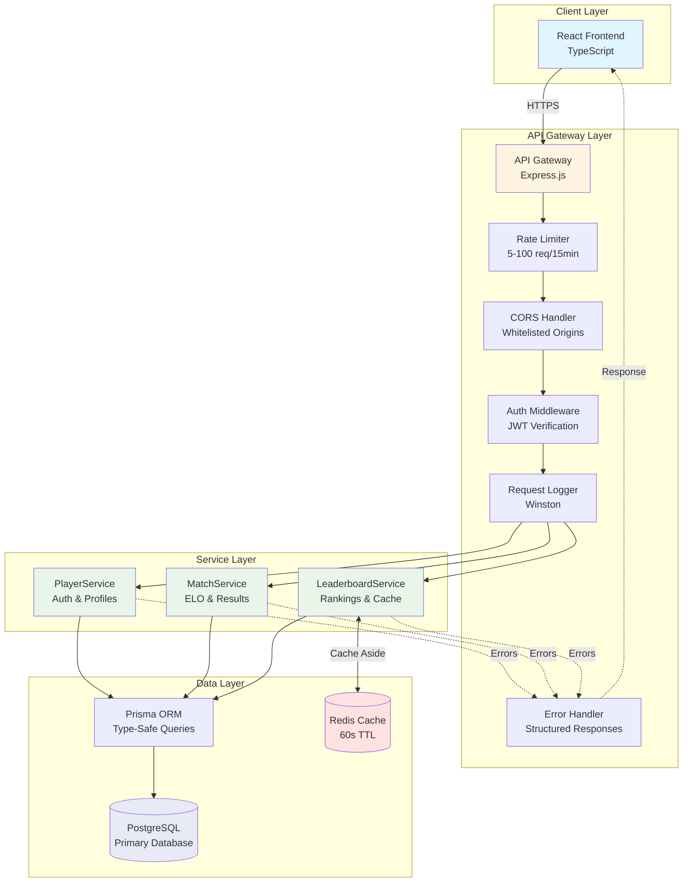
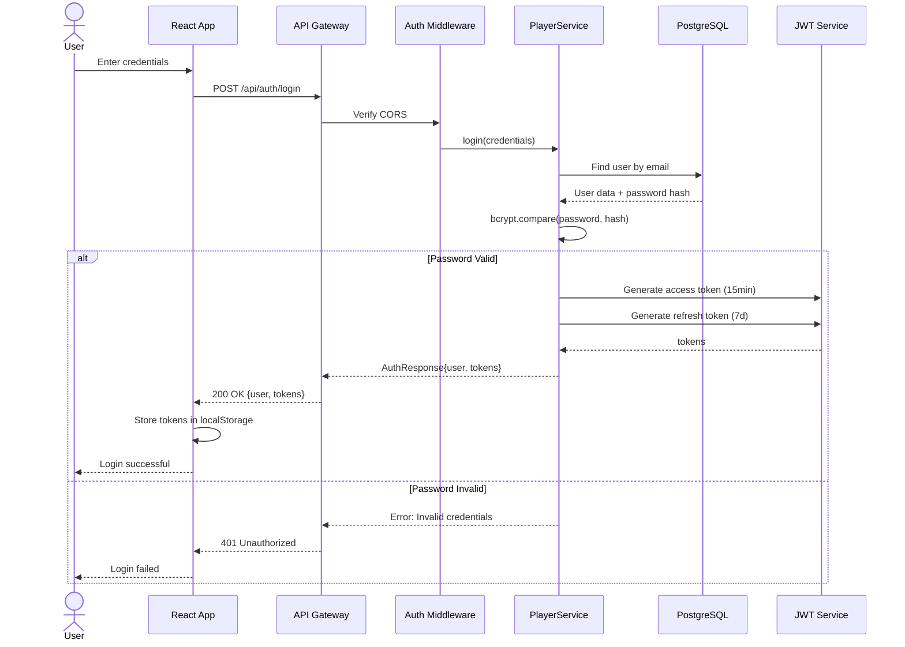
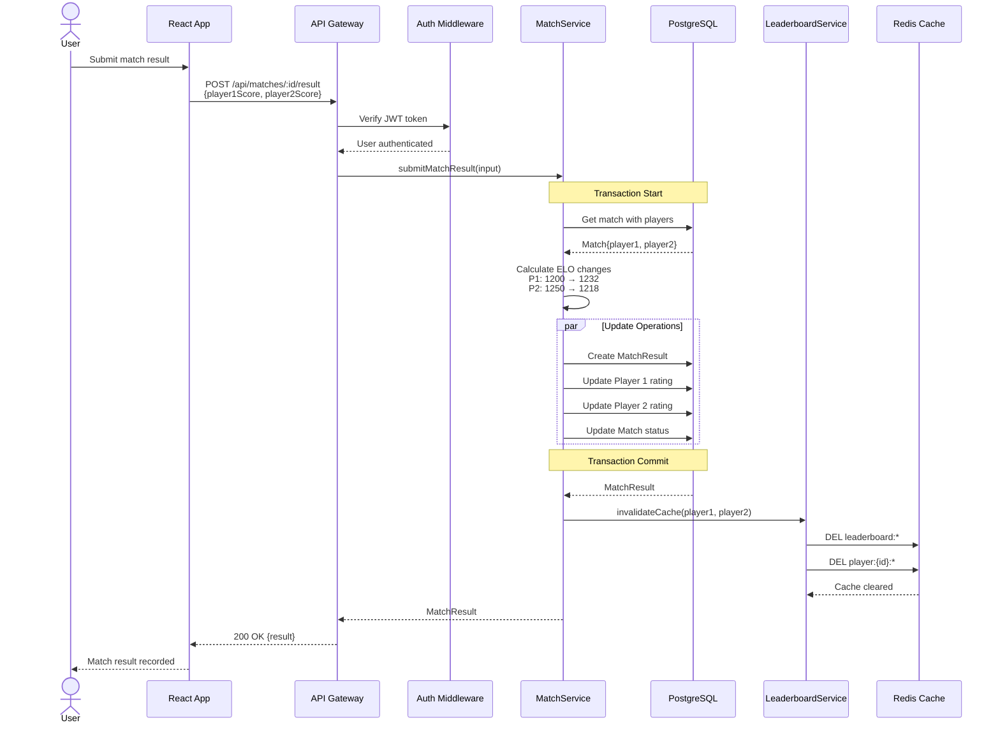
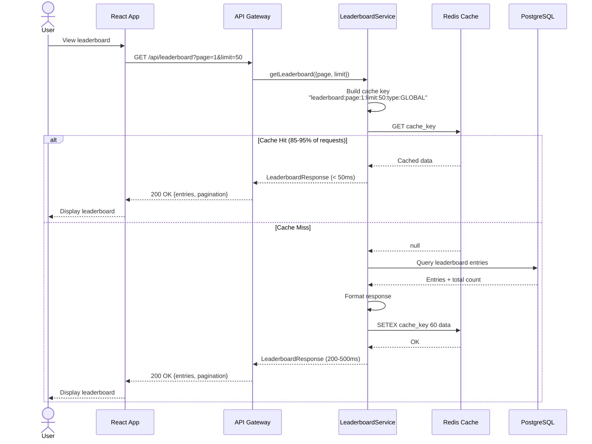
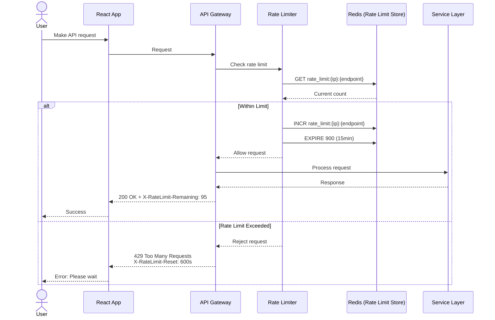
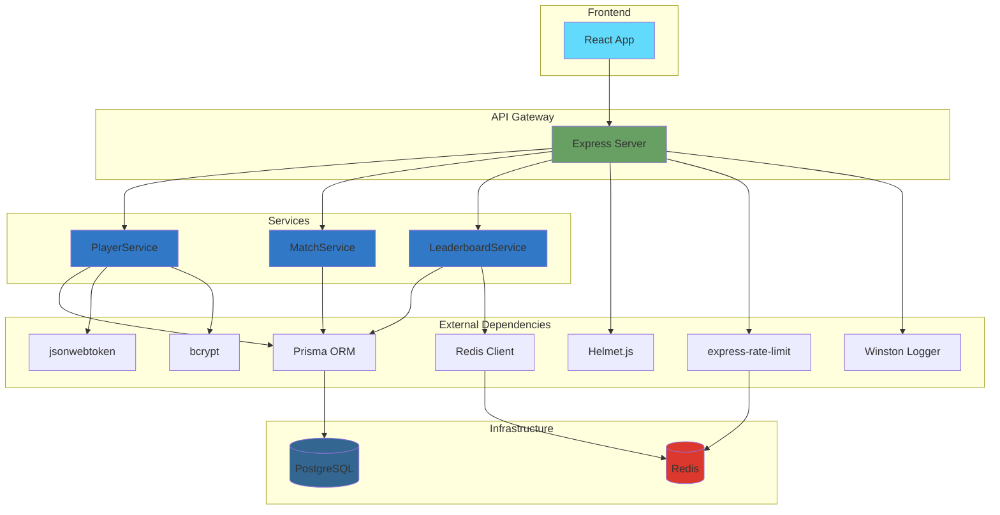
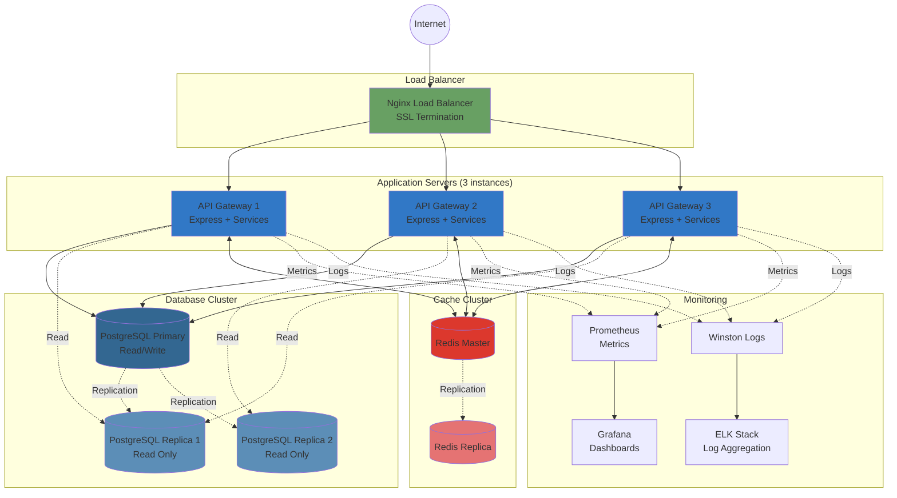

# Love Rank Pulse - Architecture Diagrams

## System Architecture Overview



## Authentication Flow



## Match Result Submission Flow



## Leaderboard Query Flow (Cache-Aside Pattern)



## Rate Limiting Flow



## Database Schema Relationships

```mermaid
erDiagram
    Player ||--o{ Match : "plays as player1"
    Player ||--o{ Match : "plays as player2"
    Player ||--o{ MatchResult : "wins"
    Player ||--o{ MatchResult : "loses"
    Player ||--o{ LeaderboardEntry : "has"
    Match ||--|| MatchResult : "has"

    Player {
        string id PK
        string username UK
        string email UK
        int elo_rating
        int rank
        int matches_played
        int wins
        int losses
        int draws
        datetime created_at
        datetime last_active_at
    }

    Match {
        string id PK
        string player1_id FK
        string player2_id FK
        enum status
        enum match_type
        datetime created_at
        datetime completed_at
    }

    MatchResult {
        string id PK
        string match_id FK UK
        string winner_id FK
        string loser_id FK
        int player1_score
        int player2_score
        int rating_change
        int winner_new_elo
        int loser_new_elo
        enum result_type
        datetime created_at
    }

    LeaderboardEntry {
        string id PK
        string player_id FK
        int rank
        int previous_rank
        int rank_change
        int elo_rating
        int peak_elo
        int wins
        int losses
        int draws
        float win_rate
        datetime last_updated
    }
```

## Service Dependencies



## ELO Rating Calculation Flow

```mermaid
flowchart TD
    Start[Match Completed] --> GetRatings[Get Current Ratings<br/>Player 1: R₁<br/>Player 2: R₂]
    GetRatings --> CalcExpected[Calculate Expected Scores<br/>E₁ = 1/(1+10^((R₂-R₁)/400))<br/>E₂ = 1/(1+10^((R₁-R₂)/400))]
    CalcExpected --> GetActual[Get Actual Scores<br/>Win: 1.0<br/>Draw: 0.5<br/>Loss: 0.0]
    GetActual --> CalcNew[Calculate New Ratings<br/>R₁_new = R₁ + K*(S₁ - E₁)<br/>R₂_new = R₂ + K*(S₂ - E₂)<br/>K-Factor = 32]
    CalcNew --> Clamp[Clamp Ratings<br/>Min: 100<br/>Max: 3000]
    Clamp --> Round[Round to Integer]
    Round --> CalcChange[Calculate Change<br/>Δ = |R_new - R_old|]
    CalcChange --> UpdateDB[Update Database<br/>Transaction Start]
    UpdateDB --> CreateResult[Create MatchResult]
    CreateResult --> UpdateP1[Update Player 1 Rating]
    UpdateP1 --> UpdateP2[Update Player 2 Rating]
    UpdateP2 --> UpdateMatch[Update Match Status]
    UpdateMatch --> Commit[Transaction Commit]
    Commit --> InvalidateCache[Invalidate Leaderboard Cache]
    InvalidateCache --> End[Complete]

    style Start fill:#e1f5ff
    style CalcExpected fill:#fff4e1
    style CalcNew fill:#fff4e1
    style UpdateDB fill:#ffe1e1
    style Commit fill:#e8f5e9
    style End fill:#e1f5ff
```

## Cache Invalidation Strategy

```mermaid
flowchart TD
    Event{Cache Invalidation<br/>Event}

    Event -->|Match Result| MatchEvent[Match Completed]
    Event -->|Player Action| PlayerEvent[Player Profile Updated]
    Event -->|System| SystemEvent[Rank Recalculation]

    MatchEvent --> InvalidatePlayer[Invalidate Player Caches<br/>player:{id}:*]
    MatchEvent --> InvalidateLeaderboard[Invalidate Leaderboard<br/>leaderboard:*]

    PlayerEvent --> InvalidatePlayerProfile[Invalidate Player Profile<br/>player:{id}:*]

    SystemEvent --> InvalidateAll[Invalidate All Caches<br/>leaderboard:*<br/>player:*]

    InvalidatePlayer --> Redis1[(Redis DEL)]
    InvalidateLeaderboard --> Redis1
    InvalidatePlayerProfile --> Redis2[(Redis DEL)]
    InvalidateAll --> Redis3[(Redis FLUSHDB)]

    Redis1 --> WarmCache1[Warm Cache<br/>Pre-fetch Top 100]
    Redis2 --> End1[Complete]
    Redis3 --> WarmCache2[Warm Cache<br/>Pre-fetch Top 3 Pages]

    WarmCache1 --> End2[Complete]
    WarmCache2 --> End3[Complete]

    style Event fill:#fff4e1
    style InvalidatePlayer fill:#ffe1e1
    style InvalidateLeaderboard fill:#ffe1e1
    style InvalidateAll fill:#ffe1e1
    style WarmCache1 fill:#e8f5e9
    style WarmCache2 fill:#e8f5e9
```

## Deployment Architecture (Production)



---

**Generated**: 2025-10-21
**Version**: 1.0.0
